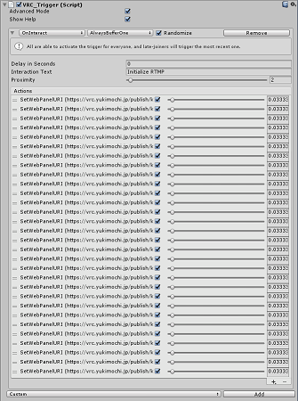
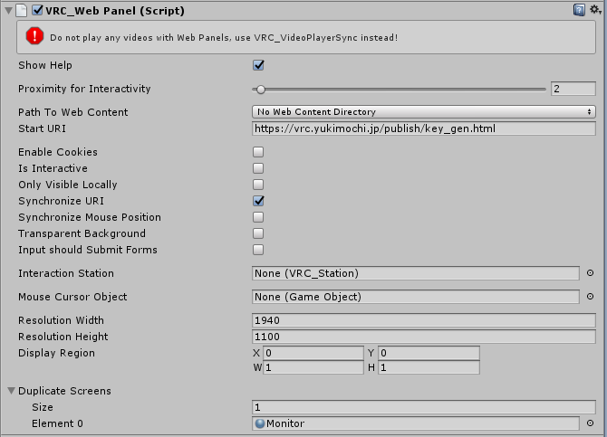

# YUKIMOCHI RTMP-VRChat Gateway

## これはなに?
VRChat で RTMP ベースの生配信をインスタンスに対して行うための3つのアプリケーションを同梱しています。

## 同梱物

### VRChat の WebPanel で使用するための RTMP Streaming Player
 - YUKIMOCHI VRC_RTMP Player (`static/endpoint.html`)

クエリ文字列によって再生するストリーミングを選択できるので、 `Set-WebPanelURI` や javascript のページ遷移を用いて、動画の切り替えが可能。
````
location.href="http://example.jp/endpoint.html?addr=*******&streamkey=******"
````

### Instance ごとに異なる StreamKey を提供する仕組み
 - YUKIMOCHI VRC_RTMP Instance Key Gen (`static/key_gen.html`)

VRChat で同一ワールドのインスタンスが複数建てられた場合に、それぞれに異なるストリームキーを付与するための仕組み。

クエリ文字列 `sid` が与えられると、日付と混ぜられてストリームキーが生成される。

（ストリームキーは、クエリ文字列 `sid` と UTC での日付で決定される。）
````
var player_url = "https://vrc.yukimochi.jp/publish/endpoint.html";
var endpoint = "rtmp://vrc-rtmp.yukimochi.jp/live";
````
また、当該 html 冒頭の変数にあるようなアドレスに、 VRC_RTMP Player に対応したクエリ文字列を付与して勝手に リダイレクトする。

`sid` をインスタンスごとにランダムにする"かつ"、あとから入室したユーザにも同じ値を提供するには、 `VRC_Trigger` の `Randomize` を有効にして、大量に `sid` を埋め込んだ URL を入れておくしかない。

 設定の参考：

 

 `Set-WebPanelURI` にエンドポイントとストリームキーを埋め込まない理由は、何らかの変更があったときに、 サーバのアドレスやストリームキーの変換ロジックをワールドの変更なしで変えられないため。

### RTMP サーバ
 - nginx w/ nginx-rtmp-module (`Dockerfile`)

nginx に nginx-rtmp-module というモジュールを追加して、 RTMP サーバを作ります。

同梱の `Dockerfile` または `docker-compose.yml` を使えば、ワンタッチで上記の2アプリを公開する Web サーバと RTMP サーバの両方が自動的に完成します。

## 使い方

### RTMP サーバの構築
 1. Linux ベースのサーバを用意し、git, [Docker](https://docs.docker.com/install/linux/docker-ce/ubuntu/) および [Docker-Compose](https://docs.docker.com/compose/install/#install-compose) をインストールします。
 2. ホームディレクトリで以下の通りのコマンドを実行します。
 ````
git clone https://github.com/yukimochi/VRC_RTMP.git //コードのダウンロード
cd VRC_RTMP //ディレクトリの移動
sudo docker-compose build //nginxのセットアップをします。
sudo docker-compose up -d //サーバが起動します。
 ````

 ※ サーバの停止コマンド `sudo docker-compose stop`

 ※ サーバの起動ログ表示コマンド `sudo docker-compose logs` //正常起動した場合何も表示されない。

 ※ httpのアクセスログの場所 `./logs/access.log`
 
 ※ rtmpとエラーのログの場所 `./logs/error.log` //rtmp のログが error の方に出力される原因は不明。

 3. `http://<サーバのIPアドレス>/key_gen.html` にアクセスすると、`static/key_gen.html` を見ることができるか確認する。
 4. `rtmp://<サーバのIPアドレス>/live` に RTMP 配信（OBS-Studio など使用）できるか確認する。
 5. セキュリティを確保するため、`nginx.conf` を変更します。

  - 変更前
 ````nginx.conf 
rtmp {
  server {
    listen 1935;

    application live {
      live on;
      record off;
      allow publish all; //誰でも、配信が可能になっている。（上が優先度大）
      deny publish all; //この設定は、無視される。
      allow play all;
    }
  }
}

 ````

  - 変更後
 ````nginx.conf 
rtmp {
  server {
    listen 1935;

    application live {
      live on;
      record off;
      allow publish <配信PCのグローバルIPアドレス>; //自分のIPアドレス以外の配信は、許可されない。
      deny publish all; //上の条件に満たない場合、この条件によって配信が禁止される。
      allow play all;
    }
  }
}

 ````

 ※ 設定変更後は、 `sudo docker-compose stop` と `sudo docker-compose start` で必ず再起動します。

### ワールドの設定
 6. -1 （全てのワールドで1つの配信を見せる場合）ワールドの Web Panel にプレーヤーの URL を設定します。

 プレーヤーは、 `addr` 変数に URL エンコードしたサーバアドレス、 `streamkey` にストリームキーを設定します。
 （ここで決定したストリームキーで配信することになります。）

 `http://<サーバのIPアドレス>/endpoint.html?addr=rtmp%3A%2F%2F<サーバのIPアドレス>%2Flive&streamkey=<ストリームキー>`

 `endpoint.html` は、 1940*1100 で表示されることを期待しています。

 設定の参考：
 
 

 6. -2（インスタンスごとに別の配信を見せたいとき） ＜略＞

 7. 色合いがおかしい件の修正。

 Web Panel では、色の発色がおかしいという現象が[見つかっています](http://uuupa.hatenablog.com/entry/2018/04/05/003936)。

 Duplicate Screen で、 [UUUPA/Degamma (MIT Licence)](https://github.com/UUUPA/Degamma) などのシェーダを適用するとよい。
