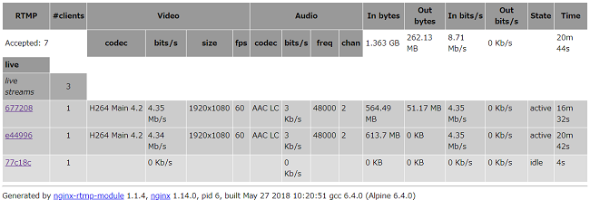

# YUKIMOCHI RTMP-VRChat Gateway

## これはなに?
VRChat で RTMP ベースの生配信をインスタンスに対して行うための3つのアプリケーションを同梱しています。

## 同梱物

### VRChat の WebPanel で使用するための RTMP Streaming Player
 - YUKIMOCHI VRC_RTMP Player (`static/endpoint.html`)

クエリ文字列によって再生するストリーミングを選択できるので、 `Set-WebPanelURI` や javascript のページ遷移を用いて、動画の切り替えが可能。
````
location.href="http://example.jp/endpoint.html?addr=*******&streamkey=******"
````

また、 javascript の `audio_control` 関数を実行することで、オーディオの音量とパン（左右の音量割合）を変更できます。

#### audio_control (volume:Number, pan:Number)
  - volume (Number) : 音量を設定する。 `0 ~ 100` までの整数値。初期設定では `100` 。 `100` を超えるとなんかやばい音がする。
  - pan (Number) : 左右の音のふり具合を設定する。 `-100` (左に全振り) ~ `100` (右に全振り) まで設定可能。初期設定では `0` 。

  例：( `Set-WebPanelURI` や ブックマークレット)
  ````
  javascript:setTimeout(audio_control(50,0),0);
  ````
  謎： VRChat の `Set-WebPanelURI` で動かすブックマークレットは、 setTimeout でラップしないと動かないの多いよね。なんでかは知らない。 Vorlon.js のコンソールからなら普通に呼んでも使えた。

### Instance ごとに異なる StreamKey を提供する仕組み
 - YUKIMOCHI VRC_RTMP Instance Key Gen (`static/key_gen.html`)

VRChat で同一ワールドのインスタンスが複数建てられた場合に、それぞれに異なるストリームキーを付与するための仕組み。

クエリ文字列 `sid` が与えられると、日付と混ぜられてストリームキーが生成される。

（ストリームキーは、クエリ文字列 `sid` と UTC での日付で決定される。）

また、 VRC_RTMP Player に生成されたストリームキーを付与してリダイレクトする。

`sid` をインスタンスごとにランダムにする"かつ"、あとから入室したユーザにも同じ値を提供するには、 `VRC_Trigger` の `Randomize` を有効にして、大量に `sid` を埋め込んだ URL を入れておくしかない。

 設定の参考：

 

 `Set-WebPanelURI` にエンドポイントとストリームキーを埋め込まない理由は、何らかの変更があったときに、 サーバのアドレスやストリームキーの変換ロジックをワールドの変更なしで変えられないため。

### RTMP サーバ
 - nginx w/ nginx-rtmp-module (`Dockerfile`)

nginx に nginx-rtmp-module というモジュールを追加して、 RTMP サーバを作ります。

同梱の `Dockerfile` または `docker-compose.yml` を使えば、ワンタッチで上記の2アプリを公開する Web サーバと RTMP サーバの両方が自動的に完成します。

## 使い方

### RTMP サーバの構築
 1. Linux ベースのサーバを用意し、git, [Docker](https://docs.docker.com/install/linux/docker-ce/ubuntu/) および [Docker-Compose](https://docs.docker.com/compose/install/#install-compose) をインストールします。
 2. ホームディレクトリで以下の通りのコマンドを実行します。
 ````
git clone https://github.com/yukimochi/VRC_RTMP.git //コードのダウンロード
cd VRC_RTMP //ディレクトリの移動
sudo docker-compose build //nginxのセットアップをします。
sudo docker-compose up -d //サーバが起動します。
 ````

 ※ サーバの停止コマンド `sudo docker-compose stop`

 ※ サーバの起動ログ表示コマンド `sudo docker-compose logs` //正常起動した場合何も表示されない。

 ※ httpのアクセスログの場所 `./logs/access.log`
 
 ※ rtmpとエラーのログの場所 `./logs/error.log` //rtmp のログが error の方に出力される原因は不明。

 3. `http://<サーバのIPアドレス>/key_gen.html` にアクセスすると、`static/key_gen.html` を見ることができるか確認する。
 4. `rtmp://<サーバのIPアドレス>/live` に RTMP 配信（OBS-Studio など使用）できるか確認する。
 5. -1 セキュリティを確保するため、`nginx.conf` を変更します。

  - 変更前
 ````nginx.conf
rtmp {
  server {
    listen 1935;

    application live {
      live on;
      record off;
      allow publish all; //誰でも、配信が可能になっている。（上が優先度大）
      deny publish all; //この設定は、無視される。
      allow play all;

      on_publish http://auth:3000/auth;
    }

    # Comment out to enable relay to YouTube Live etc...
    #application multi {
    #  live on;
    #  record off;
    #  allow publish all;
    #  deny publish all;
    #  allow play all;

    #  on_publish http://auth:3000/auth;

    #  push rtmp://a.rtmp.youtube.com/live*/***********
    #  push rtmp://live-tyo.twitch.tv/app/***********
    }
  }
}
 ````

  - 変更後
 ````nginx.conf 
rtmp {
  server {
    listen 1935;

    application live {
      live on;
      record off;
      allow publish <配信PCのグローバルIPアドレス>; //自分のIPアドレス以外の配信は、許可されない。
      deny publish all; //上の条件に満たない場合、この条件によって配信が禁止される。
      allow play all;
    }

    # Comment out to enable relay to YouTube Live etc...
    #application multi {
    #  live on;
    #  record off;
    #  allow publish all;
    #  deny publish all;
    #  allow play all;

    #  on_publish http://auth:3000/auth;

    #  push rtmp://a.rtmp.youtube.com/live*/***********
    #  push rtmp://live-tyo.twitch.tv/app/***********
    }
  }
}

 ````

 ※ 設定変更後は、 `sudo docker-compose stop` と `sudo docker-compose start` で必ず再起動します。

 5. -2 配信状況の統計情報を表示できるようにしたい場合、コメントアウトされた以下の部分を修正します。
  - 変更前
 ````
    # Comment out to enable statistics.
    #location /statistics/view {
    #  rtmp_stat all;
    #  rtmp_stat_stylesheet /stat.xsl;
    #}
 ````

  - 変更後
 ````
    # Comment out to enable statistics.
    location /statistics/view {
      rtmp_stat all;
      rtmp_stat_stylesheet /stat.xsl;
    }
 ````

 設定適応後は、 `http://<サーバのIPアドレス>/statistics/view` にアクセスすると、以下のような統計情報を確認できます。

 

 5. -3 YouTube Live など他の配信サービスに配信を転送したい場合、 `rtmp://<サーバのIPアドレス>/multi` へ配信するようにします。 それに伴い、以下の通りに設定を変更します。

  - 変更前
 ```` 
    # Comment out to enable relay to YouTube Live etc...
    #application multi {
    #  live on;
    #  record off;
    #  allow publish all;
    #  deny publish all;
    #  allow play all;

    #  on_publish http://auth:3000/auth;

    #  push rtmp://a.rtmp.youtube.com/live*/***********
    #  push rtmp://live-tyo.twitch.tv/app/***********
    }
 ````

  - 変更後
 ````
    # Comment out to enable relay to YouTube Live etc...
    application multi {
      live on;
      record off;
      allow publish all;
      deny publish all;
      allow play all;

      on_publish http://auth:3000/auth;

      push rtmp://a.rtmp.youtube.com/live*/*********** //あなたの配信したいプラットフォームのRTMPアドレスを指定します。
      push rtmp://live-tyo.twitch.tv/app/*********** //あなたの配信したいプラットフォームのRTMPアドレスを指定します。
    }
 ````

 6. 配信に利用できるストリームキーを設定するため `auth.json` を変更します。
 
  - 変更前
 ````
 {
    "application": {
        "live": [
            "stream",
            "sub_stream"
        ],
        "multi": [
            "multi_stream"
        ]
    }
}
 ````

  - 変更後
 ````
 {
    "application": {
        "live": [
            "<配信に使いたいストリームキー1>",
            "<配信に使いたいストリームキー2>",
            "<配信に使いたいストリームキー3>"  //数は無制限。
        ],
        "multi": [
            "<転送配信に使いたいストリームキー>" //1つまで。
        ]
    }
}
 ````

### ワールドの設定
 7. -1 （全てのワールドで1つの配信を見せる場合）ワールドの Web Panel にプレーヤーの URL を設定します。

 プレーヤーは、 `addr` 変数に URL エンコードしたサーバアドレス、 `streamkey` にストリームキーを設定します。
 （ここで決定したストリームキーで配信することになります。）

 `http://<サーバのIPアドレス>/endpoint.html?addr=rtmp%3A%2F%2F<サーバのIPアドレス>%2Flive&streamkey=<ストリームキー>`

 `endpoint.html` は、 1940*1100 で表示されることを期待しています。

 ※ 転送配信側 ( `/multi` ) を視聴する場合、以下のプレーヤーの URL を設定します。

 `http://<サーバのIPアドレス>/endpoint.html?addr=rtmp%3A%2F%2F<サーバのIPアドレス>%2Fmulti&streamkey=<ストリームキー>`

 設定の参考：
 
 

 7. -2（インスタンスごとに別の配信を見せたいとき） ＜略＞

 8. 色合いがおかしい件の修正。

 Web Panel では、色の発色がおかしいという現象が[見つかっています](http://uuupa.hatenablog.com/entry/2018/04/05/003936)。

 Duplicate Screen で、 [yukimochi/WebPanel-Shaders](https://github.com/yukimochi/WebPanel-Shaders
) などの代替シェーダを適用します。
